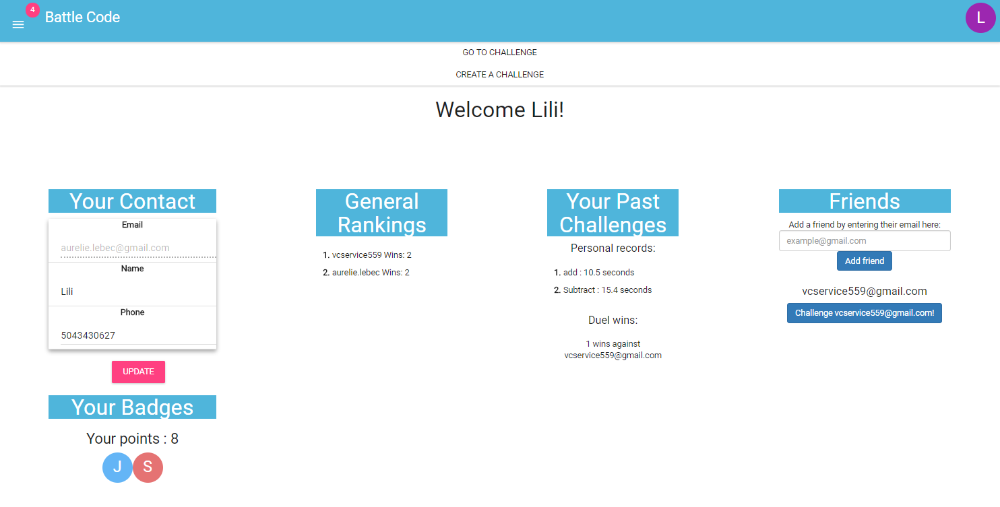
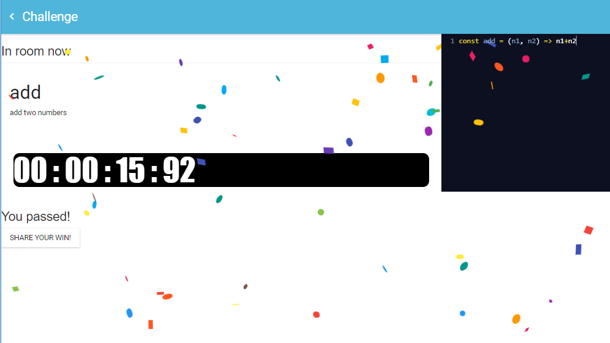

# BattleCode

Test your coding skills against anyone. Then create new challenges for others to test themselves against!

## Team

  - __Product Owner__: Preston Winstead 
  - __Lead Engineer__: Lily Lebec 

## Table of Contents

1. [How it works](#how-it-works)
2. [App Wireframe](#wireframe)
3. [Database](#database)
4. [Tech Stack](#tech-stack)
5. [Development](#development)
    1. [System Requirements](#system-requirements) 
    2. [Installation](#installation)

## <a name="how-it-works"></a>How it Works

>Bringing fast paced fun to coding.
>BattleCodes lets you solve programming challenges in a race against friends. 
>Want to prove that you're the best coder among your friends? Now you can! 
>Create custom challenges and challenge your friends to a battle to prove your dominance. Just don't sink beneath the pressure of the timer!

## <a name="wireframe"></a>App Wireframe



## <a name="Database"></a>Database


## <a name="tech-stack"></a>Tech Stack


## <a name="development"></a>Development
Setting up a development environment requires global installations of node

### <a name="system-requirements"></a>1. System Requirements

* Globally installed [node](https://nodejs.org/en/) >= 4.0

### <a name="installation"></a>2. Installation

On the command prompt run the following commands

```sh
$ git clone https://github.com/Javacrypts/BattleCode.git

$ cd BattleCode/

$ npm run setup
```

**For Database:**

BattleCode uses MongoDB through Mongoose. Setup a local instance of a MongoDB or use Mlabs and reconfigure dbTools.js to connect to it.
